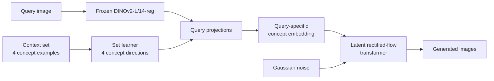

# Show Me Examples: Inferring Visual Concepts from Image Sets

[](https://arxiv.org/abs/2607.02402)
[](#citation)
[](https://github.com/CompVis/set-learner)
[](https://huggingface.co/CompVis/set-learner)
[](https://pytorch.org/)

<div align="center">
  <a href="https://nickstracke.dev">Nick Stracke</a><sup>*,1,2</sup> ·
  <a href="https://koljabauer.com">Kolja Bauer</a><sup>*,1,2</sup> ·
  <a href="https://stefan-baumann.eu">Stefan Andreas Baumann</a><sup>1,2</sup> ·
  Miguel Angel Bautista<sup>3</sup> ·
  Josh Susskind<sup>3</sup> ·
  <a href="https://ommer-lab.com">Björn Ommer</a><sup>1,2</sup>
</div>

<p align="center">
  <b><sup>1</sup>CompVis @ LMU Munich, <sup>2</sup>MCML, <sup>3</sup>Apple</b><br/>
  <sup>*</sup>Equal contribution<br/>
  European Conference on Computer Vision (ECCV), 2026
</p>

What do four seemingly different images have in common? VICIS learns visual concepts directly from example sets—without requiring a textual description—and applies the inferred concept to a new query image.

Given four context images sharing a concept and one query image, VICIS generates new images that preserve the context-defined concept at the hierarchy level implied by the query.

## ✨ Highlights

- **Concepts from examples.** Infer visual concepts directly from image sets instead of text prompts.
- **Query-aware generation.** Project a query onto learned concept directions and retain its concept-specific content.
- **Compositional hierarchy.** Train on the exact `extended_v1` ImageNet/WordNet hierarchy, including custom groupings such as `two_wheeled` and `four_wheeled`.
- **Generalization.** Apply inferred concepts to unseen classes and modalities such as sketches.
- **Minimal release.** One model file, one dataloader, one training script, and one inference script.

## 🧠 How It Works



The set learner encodes the context images jointly and predicts four normalized directions. A frozen DINOv2 encoder embeds the query; its projection onto those directions determines the query-specific concept embedding. A 24-layer latent rectified-flow transformer then generates images through a frozen Tiny Autoencoder decoder.

### Hierarchy semantics

The context concept and query jointly determine the expected hierarchy level of an output. For example:

```text
shared context concept: vehicle.n.01

context direct children:
  two_wheeled, four_wheeled, rail_vehicle, aircraft.n.01

query:
  submarine.n.01 → vessel.n.02

expected generated hierarchy level:
  vessel.n.02
```

The inference grid reports both the shared context concept and this query-derived expected level.

## 🚀 Quick Start

### 1. Install

The reference environment uses Python 3.11, PyTorch 2.6, CUDA 12.4, and BF16.

```bash
git clone https://github.com/CompVis/set-learner.git
cd set-learner

python -m venv .venv
source .venv/bin/activate
pip install -r requirements.txt
```

On first use, PyTorch Hub downloads this repository and the DINOv2 source code. The VICIS weights are downloaded automatically from [Hugging Face](https://huggingface.co/CompVis/set-learner). DINOv2 and TAESD weights are already included in the VICIS state dictionary and are not downloaded separately.

### 2. Load the model

The complete pretrained model is exposed as a single PyTorch Hub entry point:

```python
import torch

model = torch.hub.load("CompVis/set-learner", "vicis", pretrained=True)
```

This constructs the fixed architecture from GitHub, downloads `model.pt` from `CompVis/set-learner` on Hugging Face, strictly loads all 898 tensors, and returns the CUDA BF16 model in evaluation mode. The approximately 2 GB checkpoint remains excluded from Git.

### 3. Generate images

The inference CLI has two separate input modes.

#### Your own images

Supply exactly four context images and one query image. These are the only semantic inputs; no class or concept labels are required.

```bash
python -m scripts.inference images \
  --context context_1.jpg context_2.jpg context_3.jpg context_4.jpg \
  --query query.jpg \
  --output-dir outputs/my_images \
  --seed 10000 --cfg-scale 3 --num-samples 4
```

The context images must demonstrate one coherent shared concept. The model infers that concept directly from the pixels.

#### Hierarchy-controlled ImageNet example

Alternatively, specify an `extended_v1` concept and query class. The script selects four context images from distinct direct children and obtains the query from the supplied ImageNet shards:

```bash
python -m scripts.inference imagenet \
  --data-dir /path/to/imagenet_shards \
  --concept vehicle.n.01 \
  --query-class submarine.n.01 \
  --output-dir outputs/vehicle_example \
  --seed 10000 --cfg-scale 3 --num-samples 4
```

In this mode, `submarine.n.01` maps to the expected output level `vessel.n.02`; the generated grid displays that derivation. The hierarchy labels select the images and annotate the result—they are not passed to VICIS as conditioning.

The command writes:

```text
outputs/example/
  grid.png          # labeled context, query, expected level, and samples
  sample_00.png
  sample_01.png
  sample_02.png
  sample_03.png
  conditioning.pt   # directions, projections, and context embedding
```

## 📊 Hierarchy Evaluation

`scripts/eval.py` runs the ImageNet hierarchy evaluation. It samples context and query
images from local ImageNet WebDataset shards, generates VICIS outputs, and
reports accuracy and diversity metrics.

Install the extra evaluation dependencies:

```bash
pip install -r requirements-eval.txt
```

### Preparing the Eval Data

ImageNet images are not redistributed with this release. Download ImageNet-1k
through the official access process, then provide local WebDataset tar shards
whose names include `val`. Each sample must contain:

- `jpg` or `jpeg`: encoded image bytes;
- `cls`: canonical zero-based ImageNet-1k class index.

If your ImageNet copy is arranged as one folder per class, convert it with:

```bash
python -m scripts.prepare_imagenet_webdataset \
  --input-dir /path/to/imagenet/val \
  --output-dir /path/to/imagenet_shards \
  --split val
```

The converter accepts class folders named by class index, for example `0`, or
by the synset names in `vicis/extended_v1.json`, for example `tench.n.01`. For a
standard WordNet-ID folder layout such as `n01440764`, pass a mapping file:

```bash
python -m scripts.prepare_imagenet_webdataset \
  --input-dir /path/to/imagenet/val \
  --output-dir /path/to/imagenet_shards \
  --split val \
  --wnid-map /path/to/wnid_to_class_id.txt
```

The mapping file can contain either `n01440764 0` or
`n01440764 tench.n.01` entries.

### Running the Eval

Run a small end-to-end check:

```bash
python -m scripts.eval \
  --data-dir /path/to/imagenet_shards \
  --output-dir outputs/eval_smoke \
  --smoke-test \
  --batch-size 2
```

Run the full evaluation preset:

```bash
python -m scripts.eval \
  --data-dir /path/to/imagenet_shards \
  --output-dir outputs/eval_paper
```

The release preset uses four context images and 50 sampling steps.

The evaluation writes:

```text
outputs/eval_paper/
  aggregate_metrics.json
```

`aggregate_metrics.json` contains `accuracy_per_concept`,
`accuracy_per_instantiation`, and `diversity`.

## 🔧 Training

The release reproduces the accepted setup:

| Setting | Value |
|---|---:|
| Hierarchy | `extended_v1` |
| Resolution | 256 × 256 |
| Context images | 6 stored, dynamic prefixes of 2–6 |
| Query/target pairs | 30 per set |
| Local batch size | 5 |
| Precision | BF16 |
| Optimizer | Adam, `lr=1e-4`, betas `(0.9, 0.99)` |
| Schedule | 300-step warmup, then constant |
| Gradient clipping | 1.0 |

The bundled `vicis/extended_v1.json` contains the exact hierarchy, direct-child, superclass, and ImageNet class tables used by `diffusion.data.images_with_attrs.ImageNetModule`.

### Data Format

Training uses the same WebDataset shard format as the hierarchy evaluation,
with shard names containing `train`.

The loader maintains a dynamic 100,000-image pool. For each batch it selects a shared hierarchy concept, assembles its context set from direct children, and samples query/target pairs according to the same hierarchy.

### Single GPU

```bash
python -m scripts.train \
  --data-dir /path/to/imagenet_shards \
  --output-dir outputs/train
```

### Multi-GPU

```bash
torchrun --standalone --nproc_per_node=4 --module scripts.train \
  --data-dir /path/to/imagenet_shards \
  --output-dir outputs/train
```

To initialize training from the published weights, first download `model.pt` from the [Hugging Face model repository](https://huggingface.co/CompVis/set-learner) and pass it with `--init-checkpoint`. Alternatively, resume model, optimizer, scheduler, and step state with:

```bash
python -m scripts.train \
  --data-dir /path/to/imagenet_shards \
  --resume outputs/train/checkpoints/step_N/training.pt
```

Every checkpoint directory contains `model.pt` for inference and `training.pt` for full resumption. When training from scratch, pretrained DINOv2 and TAESD backbones are initialized automatically.

### Sanity check

Use `--smoke-test --max-steps 1` for an end-to-end reduced-data diagnostic. A controlled single-GPU overfit test on one valid `extended_v1` batch reduced reconstruction loss from `0.9457` to `0.1100` in eight optimizer steps.

## 🗂️ Repository Layout

```text
set-learner/
  vicis/
    __init__.py
    model.py           # fixed VICIS architecture and checkpoint loader
    data.py            # extended_v1 ImageNet hierarchy sampler
    extended_v1.json   # exact hierarchy tables
  scripts/
    __init__.py
    train.py           # single- and multi-GPU training
    inference.py       # four-context query-conditioned generation
    eval.py            # ImageNet hierarchy evaluation
    prepare_imagenet_webdataset.py
  hubconf.py           # PyTorch Hub entry point and Hugging Face download
  MODEL_CARD.md        # Hugging Face model card
  requirements.txt
  requirements-eval.txt
  README.md
```

## ⚙️ Model Details

- DINOv2 ViT-L/14-reg image encoder at 224 × 224.
- 24-layer, width-1024 set transformer with block-diagonal flexible attention.
- Four normalized 256-dimensional set directions.
- Query projection and direction conditioning in FP32.
- 24-layer, width-1024 latent rectified-flow transformer.
- Tiny Autoencoder latent shape `4 × 32 × 32` for 256 × 256 outputs.
- Classifier-free guidance with default scale 3 and 50 sampling steps.

## 🎓 Citation

If you find VICIS useful, please cite:

```bibtex
@inproceedings{stracke2026show,
  title     = {Show Me Examples: Inferring Visual Concepts from Image Sets},
  author    = {Stracke, Nick and Bauer, Kolja and Baumann, Stefan Andreas and Bautista, Miguel Angel and Susskind, Josh and Ommer, Björn},
  booktitle = {European Conference on Computer Vision},
  year      = {2026}
}
```

## 🙏 Acknowledgements

This implementation builds on [PyTorch](https://pytorch.org/), [DINOv2](https://github.com/facebookresearch/dinov2), [Diffusers](https://github.com/huggingface/diffusers), [WebDataset](https://github.com/webdataset/webdataset), and [einops](https://github.com/arogozhnikov/einops). The transformer and rectified-flow components are adapted from the original CompVis research code.
